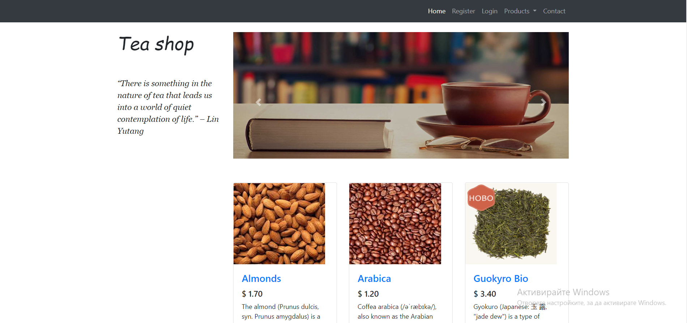
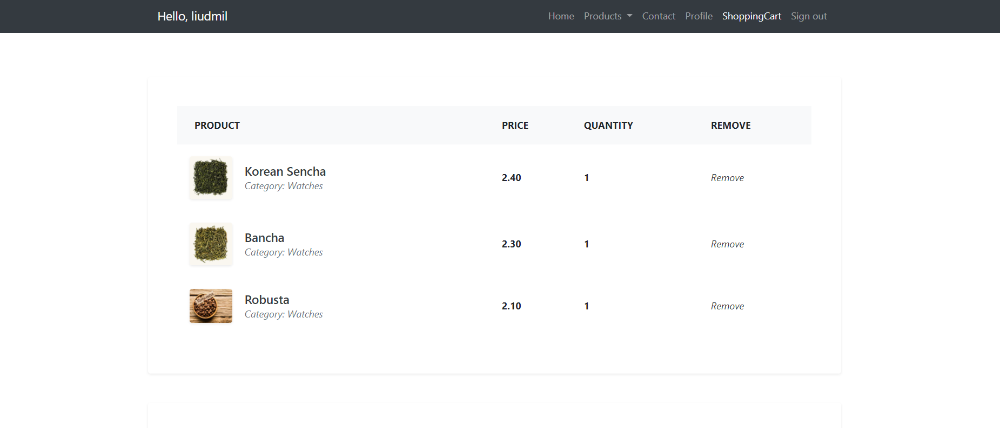

## Table of contents
* [General info](#general-info)
* [Technologies](#technologies)
* [Setup](#setup)

## General info
This project is simple e-commerce website, consisted of three basic product categories - TEA, NUTS & COFFEE.
	
## Technologies
Project is created with:
* Spring MVC and Thymeleaf
* JDK 11
* Bootstrap technology
	
## Setup
To run this project, install it locally using npm.

## Images

